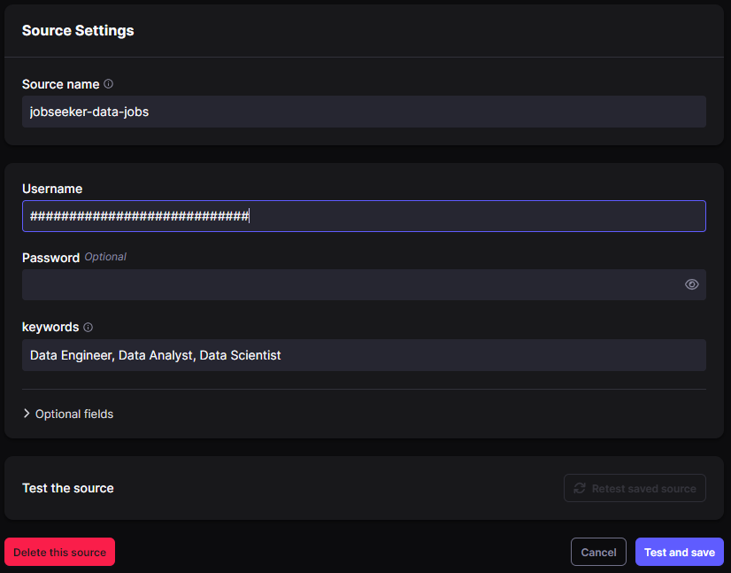
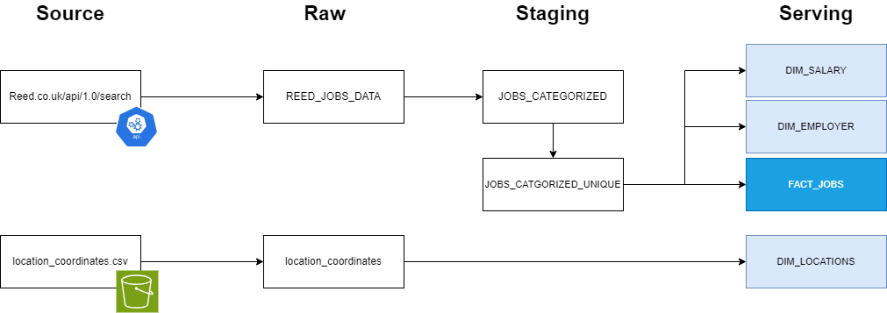
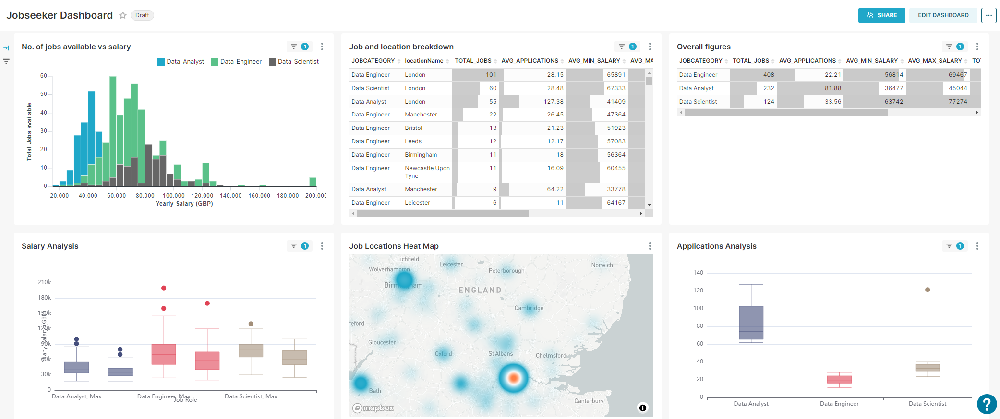

# Capstone Project - Jobseeker Analysis

## Table of Contents
<!-- TOC start (generated with https://github.com/derlin/bitdowntoc) -->
   * [Introduction](#introduction)
   * [Architecture](#architecture)
      + [Orchestration](#orchestration)
      + [Ingestion](#ingestion)
      + [YAML for Custom Connector](#yaml-for-custom-connector)
      + [Airbyte Source Settings](#airbyte-source-settings)
      + [Transformation](#transformation)
      + [Storage](#storage)
      + [Serving](#serving)
   * [Future Enhancements](#future-enhancements)

<!-- TOC end -->

## Introduction
Choosing a career path is a major decision many of us will have to make. This project aims to help by unlocking valuable insights from one of the largest job portals in the UK. Real-time data is extracted from the Reed.co.uk API and analysed, comparing a set of jobs to each other unravelling patterns and correlations.

The job roles used as the sample data set for this project are:
> - Data Engineer
> - Data Analyst
> - Data Scientist

## Architecture


### Orchestration
Data pipeline runs are controlled by DAGs in Airflow. The 'pull_data' task is scheduled to run daily at 12am, this will trigger an Airbyte connection to start data extraction from the Reed.co.uk API. The task  will monitor the connection until it finishes before triggering the next task 'run_dbt' which will start the DBT process.
> - pull_data >> run_dbt

Airflow Variables to be set are the following:
| Variable Name | Description |
| ----------- | ----------- |
| AIRBYTE_CONNECTION_ID | Refers to ID of Airbyte connection to extract data from Reed.co.uk API |
| AIRBYTE_PASSWORD | User name of Airbyte instance |
| AIRBYTE_USER | Password of Airbyte instance |
| DBT_PASSWORD | Password of user 'DBT' for Snowflake instance |

### Ingestion
A Connector is created using the inbuilt S3 source connector to draw location coordinate information into the snowflake instance. This information will be used for mapping purposes.

A Custom Connector has been created in Airbyte to extract data from the Reed.co.uk API. The 'Username' field needs to be filled by the API Key which can be obtained from https://www.reed.co.uk/developers/jobseeker. The 'keyword' input refers to the job roles to search for. This sample has been configured to 'Data Engineer, Data Analyst, Data Scientist'.

### YAML for Custom Connector
```
version: 0.51.2
type: DeclarativeSource
check:
  type: CheckStream
  stream_names:
    - JOBS_DATA
streams:
  - type: DeclarativeStream
    name: JOBS_DATA
    primary_key:
      - jobId
    schema_loader:
      type: InlineSchemaLoader
      schema:
        $schema: http://json-schema.org/schema#
        properties:
          applications:
            type: number
          currency:
            type:
              - 'null'
              - string
          date:
            type: string
          employerId:
            type: number
          employerName:
            type: string
          expirationDate:
            type: string
          jobDescription:
            type: string
          jobId:
            type: number
          jobTitle:
            type: string
          jobUrl:
            type: string
          locationName:
            type: string
          maximumSalary:
            type:
              - 'null'
              - number
          minimumSalary:
            type:
              - 'null'
              - number
        type: object
    retriever:
      type: SimpleRetriever
      requester:
        type: HttpRequester
        url_base: https://www.reed.co.uk/api/1.0
        path: /search
        http_method: GET
        request_parameters:
          keywords: '{{ config[''keywords''] }}'
        request_headers: {}
        authenticator:
          type: BasicHttpAuthenticator
          password: '{{ config[''password''] }}'
          username: '{{ config[''username''] }}'
        error_handler:
          type: CompositeErrorHandler
          error_handlers:
            - type: DefaultErrorHandler
              backoff_strategies:
                - type: ExponentialBackoffStrategy
                  factor: 3
        request_body_json: {}
      record_selector:
        type: RecordSelector
        extractor:
          type: DpathExtractor
          field_path:
            - results
      paginator:
        type: DefaultPaginator
        page_token_option:
          type: RequestOption
          inject_into: request_parameter
          field_name: resultsToSkip
        pagination_strategy:
          type: OffsetIncrement
spec:
  connection_specification:
    $schema: http://json-schema.org/draft-07/schema#
    type: object
    required:
      - username
      - keywords
    properties:
      username:
        type: string
        title: Username
        order: 0
      password:
        type: string
        title: Password
        always_show: true
        airbyte_secret: true
        order: 1
      keywords:
        type: string
        order: 2
        title: keywords
        description: Job role description
      locationname:
        type: string
        order: 3
        title: locationName
        description: filter by location
    additionalProperties: true
  documentation_url: https://example.org
  type: Spec
metadata:
  autoImportSchema:
    JOBS_DATA: true

```

### Airbyte Source Settings



### Transformation

DBT Scripts are contained in the Airflow directory airflow/dags/dbt.



Data flows through 3 different stages:
| Stage | Description |
| ----------- | ----------- |
| RAW | Data extracted from the API via Airbyte will land here first as a full extract. Table is re-created |
| STAGING | First stage of transformations. Data will be categorised based on the job roles, deduped and salary values are filtered to ensure only yearly salaries are used for analysis |
| SERVING | Final tables ready for serving in Preset Dashboards. New jobs will be appended to the main table 'fact_jobs', if a job already exists the current record will be updated with the incoming data. Historical data will be used for trends analysis |

### Storage
Data is stored and transformed in Snowflake. Access to Snowflake is via the user 'DBT'. Password is stored in a Git Hub Repository secret and a configured variable in Airflow. The following are tables created/updated as part of the transformation process grouped into the 3 stages:

| Stage | Table Names |
| ----------- | ----------- |
| RAW | REED_JOBS_DATA<br />location_coordinates |
| STAGING | JOBS_CATEGORIZED<br />JOBS_CATEGORIZED_UNIQUE |
| SERVING | FACT_JOBS*<br />DIM_SALARY*<br />DIM_LOCATIONS*<br />DIM_EMPLOYER<br />FACT_EMPLOYER_STATS<br />FACT_JOB_LOCATION_STATS<br />FACT_JOB_LOCATION_TOTALS<br />FACT_JOB_SALARIES_YEARLY<br />FACT_JOB_STATS |

\* - Table data is appended on each DBT run

### Serving
Final data is served to a dashboard in Preset. 



| Chart Name | Description |
| ----------- | ----------- |
| No. of Jobs Available vs Salary | Charts out the total number of jobs currently available with the Maximum Salary |
| Job and Location breakdown | Breakdown of current available jobs on location, total number, average number of applications and salary insights |
| Overall figures | High level insights for each Job category |
| Salary Analysis | Box plot chart showing the distribution of maximum and minimum salary ranges across each job role category |
| Job Locations Heat Map | Heat map showing density of job roles based on the location |
| Applications Analysis | Box plot chart showing the average number of applications for each job category |

## Future Enhancements
> - Automate maintenance of location coordinate data by using the google maps Geocode API
> - Make input of Job roles more configurable
> - Update transformation steps to accommodate analysis for trends over time, FACT_JOBs table is currently being updated by appending/updating records based on job_key to enable this.