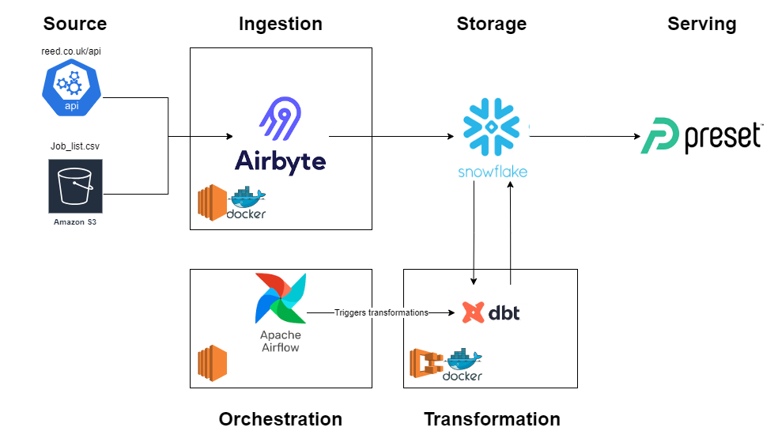

# Project plan 

## Objective 
To provide analytical data sets from job listings on the website reed.co.uk

## Consumers 
The users of this dataset can be Job seekers, recruiters or companies seeking new staff.

## Questions 
> - What is the current demand for Data Engineers/Data Scientists/Data Analysts etc.?
> - How is the demand trending over time?
> - What is the average salary range for each role by location?
> - How many job applications are there?
> - Which companies are recruiting actively?
> - Which locations have the most job opportunities? 

## Source datasets 
What datasets are you sourcing from? How frequently are the source datasets updating?

Example: 

| reed.co.uk (Jobseeker API) | REST API | https://www.reed.co.uk/developers/jobseeker |

## Solution architecture

## Breakdown of tasks 
Tasks will be set out and managed via Trello.

